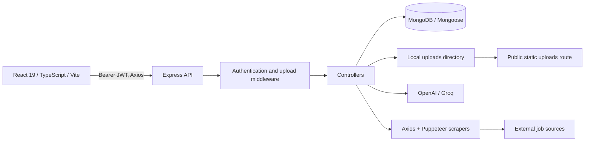
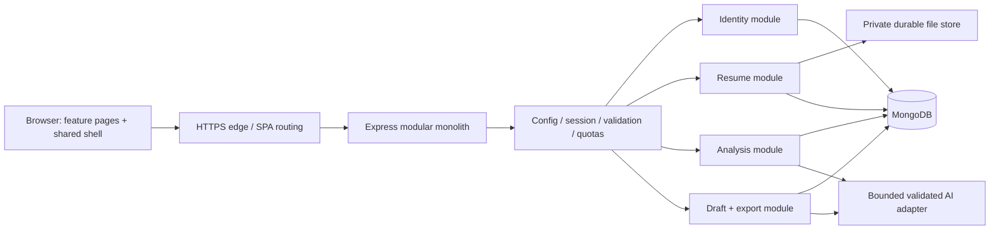

# Platform architecture

Audited 2026-09-09. Sections explicitly separate current implementation from proposed architecture. The original audit snapshot below predates the M1 implementation. No infrastructure deployment has been performed. Owner requires all current features and Vercel as the initial hosting platform. See Deployment.md for the concrete service plan.

## Module 1 implementation (2026-09-09)

App construction is separate from configuration validation, database connection, index initialization and listening. Express 5 has private responses, Helmet, exact-origin CORS and centralized safe errors. Identity uses opaque HttpOnly cookies, CSRF, authVersion revocation and one-time recovery hashes. MongoDB stores sessions, rate buckets and operation leases. AI clients initialize lazily with bounded timeouts; the unsafe scanner route is contained until M5.

The frontend uses one credentialed Axios client, in-memory CSRF state, server-validated identity and stale-response protection. Authentication/settings screens, responsive navigation, input labels, modal focus handling and reduced motion are implemented. Credentials are no longer persisted in localStorage. Private uploads/downloads and protected-field rejection are containment; M2 still owns storage lifecycle and parsing quality.

Local API/browser test harnesses, CI configuration, environment examples, a non-root Dockerfile and a Vercel routing generator now exist. No cloud account or public deployment has been created. See [the runbook](docs/m1/Runbook.md) and Work_Tracker.md for evidence and open gates.

## Original system at audit (before M1)



Frontend uses nine routed pages, auth context with localStorage, two Axios clients and Tailwind component classes. Backend is one Node process with controllers, services, six Mongoose models and disk uploads. AI, parsing, external network requests, browser launches, persistence and response generation execute inside request paths. There is no background task scheduler wired into the app, despite the node-cron dependency, no deployed infrastructure manifest, and no automated server test suite.

Existing good foundations: server-side JWT verification, bcrypt hashing, mostly user-scoped lookups, upload size cap, Mongoose constraints/indexes, a central API client and reusable UI controls. These support incremental hardening. See Audit.md for bypasses and failure paths.

## Proposed Sunday architecture



Use the same origin for SPA/API when possible, reducing deployment and session complexity. The edge serves immutable frontend assets and rewrites page routes to index.html; `/api` forwards to Node. Never rewrite API failures into HTML. Node runs as a non-root/restricted identity with production config and a readiness endpoint. Keep production and staging data, secrets and storage separate.

Recommended initial layout: Vercel SPA, external containerized Express API and isolated job worker, managed MongoDB and private object storage. A Vercel-hosted Express API is also possible after task/storage adaptation; framework support does not make the current app deployable unchanged. Never use the deployed app directory as durable storage. Object access is owner-checked; signed links have short expiry and attachment disposition. Resume metadata uses storage keys, not client-controlled OS paths.

## Module and code boundaries

Proposed structure, introduced incrementally as each module is built:

```text
server/
  app.js                    # construct Express without listen/connect side effects
  server.js                 # config validation, connect, listen, graceful shutdown
  modules/{auth,resumes,matches,builder,jobs}/
    routes.js               # authentication + validated contracts
    controller.js           # transport mapping only
    service.js              # domain rules
    repository.js           # ownership-safe persistence
    schema.js               # request/response validation
  adapters/{ai,storage,jobs}/
  middleware/{errors,auth,limits,requestId}.js
  tests/{unit,integration}/
client/src/
  app/                      # shell, router, boundaries
  features/{auth,resumes,matches,builder,jobs}/
  components/ui/            # accessible shared controls and tokens
  services/                 # transport, typed feature APIs, error normalization
```

A folder move alone is not a module completion. Enforce contracts and tests first; avoid renaming the entire repository before Sunday. TypeScript server migration, new frontend state frameworks and microservices are optional later improvements.

## Contracts and invariants

- Never accept userId, filePath, storageKey, embedding or ownership fields from writable input. Every private object lookup includes authenticated owner and lifecycle state.
- Validate input and provider output at the boundary. Centralize IDs, string/array limits, score ranges, allowed formats and error codes.
- API error target: `{ error: { code, message, fieldErrors?, requestId } }`. Do not return stacks, OS paths, tokens, raw AI output or vendor account configuration.
- List response target: `{ items, nextCursor }`; detail DTOs are deliberate projections. Introduce changed contracts consistently in client/server tests.
- Current `/jobs/scan` returns `{ jobs: [{job,match}] }`, recommended jobs return populated JobMatch arrays, but client ScanResponse claims JobMatch[]. Normalize this before consuming scan results directly.
- Scores refer to immutable resume version and JD content hash, with provider/model/scoringVersion and timestamp. Distinguish absent evidence from zero score. All values must be finite and bounded.
- Draft facts are user-supplied or explicitly reviewed. AI suggestions cannot silently add employers, credentials, years or numerical achievements. Generated output and source facts remain distinguishable.
- Save/deletion/scan retries are idempotent; unrelated failures must not corrupt previously confirmed state. Do not wrap provider calls inside a long database transaction.

## AI and task execution

For launch, use one bounded analysis call where feasible, explicit timeout/retry cap and provider-output validation. Lazy-initialize providers so missing optional capabilities do not prevent auth/library use. Store capability status; expose a safe unavailable message. Avoid repeated expensive analysis calls in both match and detailed-analysis paths.

Job discovery is mandatory and needs a bounded durable task record: queued/running/succeeded/partial/failed/cancelled. Return an operation ID and poll through an owner-checked endpoint; limit tasks per user and worker concurrency. A Mongo-backed task queue may suffice for a small deployment; choose Redis only when justified. Use leases, retries, cancellation and restart recovery. External fetch workers need isolated network/file access; safe URL rules apply to redirects and browser subrequests. Keep the unsafe scan route contained during development; its gate must pass for public launch.

## Deployment and operations

1. Pin a runtime compatible with the lockfile engines, use lockfile-based clean installs and build on CI. Audited local Node is 22.13.1; choose a supported patched runtime at implementation time. Existing README's generic Node 18 minimum is inconsistent with locked Vite 7 and mongodb 7 engines.
2. Validate PORT, NODE_ENV, MONGODB_URI, session secret, client origin, upload cap and enabled-provider keys at startup. No production fallback to local Mongo.
3. `/api/health` can be lightweight liveness; add readiness that fails for unusable DB/storage. Do not expose detailed environment flags publicly.
4. Restrict DB credentials and network access, set TLS and private storage permissions, define uploads/derived-data retention, record backup RPO/RTO and test restoration before public data intake.
5. Redact logs; correlate requests and AI task failures with request IDs. Track latency, error rate, queue size, upload storage usage, provider spend and failed logins without resume content.
6. Graceful SIGTERM drains requests/tasks and closes database connections. Configure proxy/body/provider timeouts coherently.
7. Rollback uses prior immutable application build plus backward-compatible schema changes. Back up before migrations; never blindly roll back data by dropping new fields/indexes.

## Architecture decisions

| Decision | Reason | Revisit trigger |
|---|---|---|
| Keep modular monolith | Existing stack can serve core journey; deadline favors fewer moving parts | Independent scaling/ownership actually needed |
| Private file adapter | Fixes access control and deployment persistence | Multi-instance operation requires shared store |
| Structured versioned draft | Reliable editing, score provenance and complete export | More templates do not change the canonical content model |
| Isolate and gate Jobs module | Required functionality must be real, bounded and independently testable | Scaling or provider coverage changes |
| Shared UI tokens + feature hooks | Consistent redesign with incremental migration | Measured complexity warrants additional libraries |

Full schema/migration plan: [Database_Schema.md](Database_Schema.md). Module gates: [Modules.md](Modules.md). Release workflow: [Workflow.md](Workflow.md).

## Module 2 implemented architecture — September 11, 2026

This section supersedes the earlier local-file lifecycle description for new uploads; the object-store diagrams remain future proposals. New originals, immutable extracted source, current reviewed text and bounded versions share one Resume document. Atomic creation avoids orphan file references. Original buffers and version text are excluded from default selection; library responses contain metadata only. Legacy filePath downloads remain private and require the existing volume until a verified migration.

Upload workers have bounded parsing time and V8 heap, with Mongo-backed per-account mutation serialization and three global upload slots. Save uses a revision comparison; stale input cannot overwrite newer content. Review is required before existing-resume analysis/generation. Deletion hides content first, removes linked Match/JobMatch data, then deletes the original-bearing Resume; pending cleanup is retryable from the library.

The React data router supports unsaved route guards. Session-expired review drafts are kept only in tab memory for the same account, cleared on explicit logout. M3/M4 still own provider truthfulness and immutable analysis/draft contracts. See [M2 runbook](docs/m2/Runbook.md) for limits and rollback boundaries.

