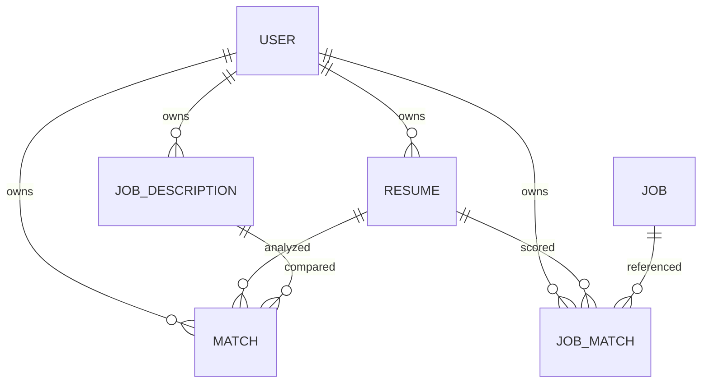

# Database schema and migration plan

Audited 2026-09-09. MongoDB/Mongoose. Current schema is derived from `server/models/*.js`; M1 changes are listed separately; later proposed changes are not implemented or migrated. Production database contents/indexes were not inspected. Mongoose refs do not enforce foreign keys or cascade deletes.

## Module 1 additions

| Model | Added state | Index / behavior |
|---|---|---|
| User | authVersion:number default 0; recoveryHash:string select:false | Optimistic concurrency on saves. Recovery consumes its HMAC hash atomically. New passwords require at least 12 Unicode characters and at most 72 UTF-8 bytes at the API; existing hashes still work for login. |
| Session / sessions | tokenHash, userId, csrfToken, authVersion, expiresAt; timestamps | Unique tokenHash; userId index; expiresAt TTL 0. Raw cookie tokens are never stored. Expiry/authVersion are enforced on each protected request. |
| RateBucket / ratebuckets | string _id, count, expiresAt | Windowed HMAC identity; expiresAt TTL 0. Atomic counters shared across processes. |
| OperationLease / operationleases | string _id, owner, expiresAt | Unique _id controls per-user/global slots; expiresAt TTL 0. Expired leases are reacquired atomically. |

Identity/quota indexes initialize before listening. These additions are implemented and tested against isolated MongoDB only; no migration has touched the project database. Existing JWTs are retired and users must sign in again. The six original application models remain, with protected resume writes and inactive access contained in M1. Physical PII retention and full deletion consistency remain M2 work.

## Original collections at audit

The six original application models have ObjectId `_id` and Mongoose `createdAt`/`updatedAt` timestamps. Collection names below are conventional Mongoose pluralizations; confirm actual names in the deployed database.

| Model / collection | Fields and constraints | Indexes / defaults |
|---|---|---|
| User / users | name: required trimmed string; email: required lowercased trimmed string with regex; password: required string, min 6, select:false; avatar:string; preferences:{jobTitle,location,remote,minSalary,maxSalary} | unique email; avatar null; password bcrypt-hashed with cost 12 in pre-save hook |
| Resume / resumes | userId: required User ref; fileName,filePath,mimeType,extractedText: required strings; fileSize: required number; sections:{summary,experience:[{title,company,duration,description}],education:[{degree,institution,year}],skills:[string],certifications:[string]}; embedding:[number]; isActive:boolean | userId; userId+createdAt desc; isActive true; embedding undefined in schema, controller sometimes saves null |
| JobDescription / jobdescriptions | userId required User ref; title,company,description,extractedText required strings; source enum manual/url/portal; url:string; keywords,requirements:[string]; embedding:[number] | userId; userId+createdAt desc; source manual; url/embedding null |
| Match / matches | userId,resumeId,jobDescriptionId required refs; overallScore required number 0–100; scoreBreakdown:{semanticMatch,keywordMatch,roleAlignment} 0–100; missingKeywords:[{keyword,category,importance high/medium/low,suggestion}]; recommendations:[{section,suggestion,priority high/medium/low}]; strengths,weaknesses:[string] | userId; userId+createdAt desc; resumeId+jobDescriptionId nonunique |
| Job / jobs | title,company,source,sourceUrl,description,extractedText required; location,country:string; remote,isActive:boolean; postedDate,lastScraped:date; keywords,requirements:[string]; embedding:[number] | title; company; country; unique sourceUrl; text(title,company,description); postedDate desc; source+isActive; **createdAt TTL 259200s**; country India; active true |
| JobMatch / jobmatches | userId,resumeId,jobId required refs; matchScore required 0–100; isSaved,isApplied,isIgnored booleans; notes:string | userId; userId+matchScore desc; **unique userId+jobId**; flags false, notes null |

Job source enum: indeed, linkedin, glassdoor, naukri, iimjobs, unstop, foundit, remotive, jobicy, wellfound, itjobs, cutshort, hirist, hackernews, monster, ziprecruiter, sample, other. This enum is not proof of a functioning adapter for each source.

## Current integrity problems

- Resume soft-delete retains PII; M2 must define complete retention/deletion. M1 now rejects protected-field writes and direct inactive access.
- Jobs expire while saved/applied records remain; populated jobId becomes null. TTL is approximate background deletion, not an exact user-data retention workflow.
- JobMatch uniqueness prevents multiple resume-specific scores, while action upserts can omit required fields because update validators are not enabled.
- Resume edits do not version/recompute derived text and embeddings. Historical analysis changes meaning when its referenced resume is overwritten.
- detailedAnalysis is returned but not saved. No provider/model/scoring metadata explains analysis provenance.
- There is no draft, resume contact structure, durable job-task lifecycle or explicit consent/deletion record.

## Proposed schema

| Entity | Minimum fields | Integrity / indexes |
|---|---|---|
| User | Existing identity, normalized email, validated preferences including salary currency/period if shown; consentVersion/consentedAt where required | unique normalized email; whitelist profile fields; minSalary ≤ maxSalary and nonnegative amounts |
| Session | userId, hashed token/session identifier, expiresAt, revokedAt, createdAt | unique token hash; userId+expiresAt; TTL on expiresAt for cleanup only; reject expiry/revocation before cleanup runs |
| Resume | userId, title, currentVersionId, storageKey, originalName, verifiedMime, bytes, status(uploaded/parsing/needs_review/ready/failed/deleting/deleted), parseErrorCode, deletedAt | userId+status+updatedAt desc; immutable owner/storage identifiers; never expose raw keys except scoped upload flows |
| ResumeVersion | userId, resumeId, version, content:{contact,summary,experience,education,skills,certifications,projects}, extractedText, contentHash, schemaVersion, reviewedAt | unique resumeId+version; owner-consistent refs; immutable confirmed version; max text/array sizes |
| Embedding metadata | resumeVersionId or JD/job revision, model, dimension, contentHash, vector, generatedAt, status | unique contentHash+model; validate dimension/finite values; do not return vector in list/detail DTOs |
| JobDescription | owner, title, company, rawText, normalizedText, contentHash, source and optional safe URL | userId+createdAt; bounded text; immutable snapshot/version used in Match |
| Match | owner, resumeVersionId, jobDescriptionId/hash, status, nullable overallScore, component scores with availability, full analysis, provider/model, scoringVersion, warnings, generatedAt | userId+createdAt desc+_id; idempotency key per owner; preserve completed analysis, distinguish failed from score 0 |
| ResumeDraft | userId, sourceResumeVersionId optional, content, revision, dirty/saved metadata, templateId, targetJDId optional | userId+updatedAt; compare-and-set revision to avoid overwrites; user-reviewed facts separate from suggestions |
| JobListing | source, sourceId, canonicalUrl, title, company, description, eligibility:{countries,remote,unknown}, postedAt nullable, fetchedAt, expiresAt, status, contentHash | unique source+sourceId or canonicalUrl; status+expiresAt; keep saved snapshots outside expendable cache |
| JobScore | userId, resumeVersionId, jobListingId/contentHash, score nullable, method, generatedAt | unique userId+resumeVersionId+jobListingId; score tied to immutable inputs |
| JobActivity | userId, jobListingId, listingSnapshot:{title,company,url,location,source,postedAt}, savedAt, appliedAt, ignoredAt, notes | unique userId+jobListingId; userId+savedAt; retain snapshot after source expiry; validate state transitions |
| Task | userId, type, input refs, idempotencyKey, status, attempt, leaseUntil, requestedAt, startedAt, finishedAt, result refs, errorCode | unique userId+idempotencyKey; status+leaseUntil; capped retries; sanitize errors and remove task input PII after retention period |

Contact content: name, email, phone, location, optional links with safe protocols. Experience stores role/company/start/end/current and reviewed achievement bullets; education stores degree/institution/year/details. Skills preserve user-provided groups. Empty sections stay empty; no inferred employer or degree becomes fact.

## Migration sequence and rollback

1. Inventory actual collection counts/indexes and find orphan refs, duplicate URLs and invalid JobMatch rows in staging. Export a backup and prove restore to a separate database. Never run unbounded destructive cleanup against production.
2. Fix write authorization first; stop unsafe field updates and disable public file URLs. Copy files into private storage, verify checksums and owner mappings, then switch reads. Do not delete originals until counts/hash checks and rollback window pass; contain original public route immediately.
3. Stop TTL deletion of Job documents before it destroys saved history. Preserve available snapshots for saved/applied rows; mark already-missing listings unavailable. Do not invent recovered details.
4. Add new fields/collections/indexes without dropping old ones. Backfill version 1 from actual content, with `reviewedAt=null` and provenance `legacy_import`; never mark heuristic extraction reviewed automatically.
5. Convert existing JobMatch flags to JobActivity snapshots and scores to JobScore using their current resume mapping. Scores already overwritten by older scans cannot be reconstructed; record this limitation.
6. Add strict request validation and compatible reads while backfill is in progress. Use atomic compare-and-set/idempotent writes. Validate counts, checksums, ownership, null references and index uniqueness.
7. Switch feature reads to new models per module gate, then stop legacy writes. Keep rollback-compatible fields through release. Only remove redundant indexes/collections after a reviewed retention window.

Rollback: deploy last compatible app version, stop new worker writes, retain newly written data, and investigate. Restoring an old backup into production can lose legitimate user changes; use point-in-time recovery only as a separately reviewed incident action.

## Data retention and ownership

All private reads/writes derive userId from authenticated session. Listing source data can be shared; resumes, JDs, scores, drafts and activity are private. A delete workflow removes original file, content, embeddings and dependent private analysis according to a documented policy, then verifies completion. Keep minimal non-PII deletion receipts. Backup retention and restoration must preserve deletion obligations through a documented replay mechanism. Owner must approve actual retention periods before launch; three-day cache expiry is not a privacy policy.

## Module 2 additions — September 11, 2026

Implemented in Resume, with no separate ResumeFile or ResumeVersion collection and no real database migration:

| Field | Current behavior |
|---|---|
| originalName | Original attachment filename; independent of renamed library label |
| originalData / originalHash | Private Buffer and SHA-256, excluded from default selection |
| sourceText | Immutable extracted source, excluded from default selection |
| extractedText / sections | Current reviewed full text and conservative derived sections; embedding cleared on save |
| revision / reviewStatus / reviewedAt | Starts at 0 / needs_review; successful review increments revision and sets ready |
| versions | Select-excluded bounded array of revision, text, savedAt, sha256; prior saved content is read-only |
| deletionRequestedAt | Retryable deletion marker; content access blocked while cleanup is pending |
| filePath | Optional legacy compatibility; existing private volume still needed |

Original cap is 5 MiB, 20 resumes/100 MiB originals per account. Each resume has at most 20 versions of 100,000 UTF-8 bytes; source extraction is capped at 100,000 characters. Versions are additional to the original-byte quota. The bounded document fits below 16 MiB; total deployment capacity still requires sizing. Missing legacy revision is treated as zero; first reviewed save preserves legacy source. Physical live deletion removes the original and versions with Resume, plus linked Match/JobMatch records. Backups and deletion replay remain operational gates. Proposed normalized version collections elsewhere in this document are not current implementation.

