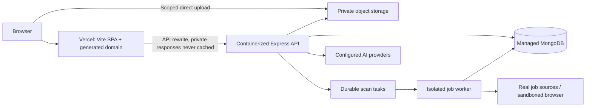

# Vercel-first deployment plan

2026-09-09. Owner selected Vercel for initial launch, has no hosting account/domain yet, and requires every current feature. This is a concrete proposed topology and checklist, **not a deployed system or authorization to purchase services**. No cloud resources, accounts or domain were created.

## Recommended topology

Recommendation: **Vercel frontend + managed MongoDB + private object store + external container API/worker**. Render is one concrete backend/worker candidate; it supports background processes that consume queued work. Account plan, region, availability and budget must be checked before provisioning. This is a project-fit recommendation, not a claim that a particular free tier supports the workload. [Render worker documentation](https://render.com/docs/background-workers).

Keep API and worker as separate processes with separate privileges. The worker needs source-network access, but not session-signing credentials or broad resume file access. Persist task leases/status so deployments or retries cannot duplicate expensive scans. Use one repository; avoid splitting into multiple repos for this deadline.

## Why the existing server cannot simply be assumed ready for Vercel

Vercel supports Express and turns an Express app into a Function. Its framework documentation states that `express.static()` does not serve static assets in that deployment mode. Adapt application startup/error handling and keep private resumes out of public assets. [Official Express guide](https://vercel.com/docs/frameworks/backend/express).

Vercel Functions document a **4.5 MB request/response payload limit**. The current UI/server promise a 5 MB multipart upload, so sending that through a Function is incompatible. Use authenticated scoped direct upload to private storage and an owner-validated completion step; verify actual platform limits again during M1. Functions also have duration/resource limits, so the present unbounded Chromium fan-out must be redesigned. [Function limitations](https://vercel.com/docs/functions/limitations).

The job process needs durable task recovery. Vercel Cron is not a substitute for queue reliability: its function duration limits apply and failed cron invocations are not automatically retried. [Cron behavior](https://vercel.com/docs/cron-jobs/manage-cron-jobs).

Vercel Blob supports private storage through its SDK and upload authorization mechanisms. Choose a private store, validate ownership when granting upload capability, and verify size/type/checksum on completion. Do not trust an arbitrary client-provided blob URL as proof of ownership. [Blob SDK](https://vercel.com/docs/vercel-blob/using-blob-sdk).

A fully Vercel-hosted API remains an alternative: Vercel Express + private Blob + managed Mongo + a separately bounded durable worker. Confirm account support and operational complexity before choosing it. The external container recommendation reduces adaptation risk for existing Puppeteer code; it does not waive its security fixes.

## M1 preparation and remaining hosting proof

The [M1 runbook](docs/m1/Runbook.md), server Dockerfile, environment examples and scripts/configure-vercel.mjs are implemented. The generator requires a provisioned HTTPS API origin and writes API-first routing with caching disabled. It does not deploy or invent a hostname. Actual Vercel/API/Mongo accounts, trusted proxy attribution and deployed two-user isolation remain pending.

## Frontend setup for M1/M6

| Setting | Planned value |
|---|---|
| Project root | `client` |
| Framework | Vite |
| Install / build | `npm ci` / `npm run build` |
| Output | `dist` |
| Public API base | `VITE_API_URL=/api` for same-origin rewrite |
| Initial domain | Vercel-generated project domain; actual URL assigned at provisioning |
| Runtime | Pin a patched supported Node runtime satisfying installed engines; verify on CI and Vercel |
| Preview isolation | Separate staging backend/DB/storage/provider quotas; preview builds cannot use production credentials |

Plan a `/api/:path*` rewrite to the provisioned backend preserving its `/api` prefix, then SPA route fallback. Do not put a placeholder production hostname into a deployed config. Confirm assets, unknown paths and API failures separately.

Vercel can proxy external API origins through rewrites. Its current docs describe cache behavior for new projects: explicitly disable shared caching of authenticated responses and set upstream `Cache-Control: private, no-store`; prove two-user isolation at the edge. [Rewrite and cache documentation](https://vercel.com/docs/routing/rewrites).

Use host-only Secure/HttpOnly session cookies issued through the same-origin API path as implemented in M1; test forwarded host/proto, CSRF and preview domains. Configure `trust proxy` to the actual trusted topology, not blanket `true`. Browser upload to storage uses a limited short-lived capability; app/session/provider secrets never enter `VITE_*` variables.

## Service configuration and secrets

| Service | Required setup | Gate |
|---|---|---|
| Vercel | Account, Git import, build settings, preview access, generated domain, API routing | M1 proof of concept; M6 verified release |
| API host | Restricted process, PORT binding, NODE_ENV=production, health/readiness, no local DB fallback, graceful shutdown | M1/M6 |
| MongoDB | Separate databases/users for staging/prod, scoped network access, TLS, backups, tested migrations | M1/M2/M6 |
| Private storage | Private store/bucket, scoped upload/download permissions, lifecycle/cleanup and backups | M2/M6 |
| Worker | Bounded concurrency, durable lease/retry, restricted egress/browser sandbox, source adapters | M5/M6 |
| AI | Real account keys, model availability smoke test, quotas/spend cap, redacted errors | M3/M4/M6 |
| Monitoring/support | Error/availability/budget alerts and a tested recipient/support path | M6 |

Existing env names: PORT, NODE_ENV, CLIENT_URL, MONGODB_URI, JWT_SECRET, OPENAI_API_KEY, GROQ_API_KEY, MAX_FILE_SIZE and client VITE_API_URL. M1 honors UPLOAD_PATH for private temporary storage and adds SESSION_HOURS and TRUST_PROXY. New session/storage/worker/provider-limit variables must be added through configuration validation and a committed secret-free example at the relevant module gate.

## Provisioning order and launch checks

1. Owner creates/signs into Vercel and chooses additional-service budget. Validate private repo connection without publishing secrets. No custom domain purchase is necessary for the initial generated-domain launch.
2. In M1, prove candidate frontend/API topology on isolated staging; in M2 prove upload persistence and owner checks; in M5 prove real scans and worker recovery. Do not postpone infrastructure feasibility until the October 11–15 release window.
3. Pin candidate revision and dependencies; configure environment-specific secrets directly with providers. Verify client bundle contains no server secrets.
4. Deploy migrations and app compatibly; seed only synthetic staging fixtures. Exercise all OPS cases, including deployed 5 MB upload, private download caching, direct routes, DB outage and backup restore.
5. Before release, all-feature gates pass, supported source coverage is accepted, no fabricated results remain and rollback target is known. Record actual domain, API/worker revision, deployment time and owner approval in Work_Tracker.md.

Cost is currently **unestimated** because accounts/plans/traffic/AI usage are not supplied. Budget for Vercel, API/worker compute, Mongo, private storage/egress and provider tokens. Set actual spend limits and alerts before public signup; do not assume the entire system can run reliably at zero cost.

## September 11 M2 storage decision

For the bounded launch workload, new original bytes and versions live atomically in private MongoDB Resume documents. A separate object store is now a future scaling option. Plan database capacity and backup cost for originals plus versions; do not assume a free tier is sufficient. Vercel serves the SPA and rewrites to the external container API, which owns multipart upload and parsing. Validate actual rewrite/body limits, no-store behavior and cookie isolation in staging; do not route a 5 MiB original through a smaller Vercel Function limit.

Legacy filePath originals are not migrated: keep the private volume attached until a separately verified migration. Rollback must retain M2-compatible original retrieval. Backup restore, deletion replay, API resource sizing and production persistence are still unverified. No accounts, domain, deployment or paid infrastructure were created. See [M2 rollout runbook](docs/m2/Runbook.md).

## Revised release window — September 20

Owner-confirmed launch target: October 15, 2026. Arrange hosting/database accounts by September 23; preserve October 11–14 for production-topology validation, private-cache and cookie checks, legacy migration/backup restore and rollback. October 15 remains subject to all feature and release gates. Account provisioning has not been performed by this schedule update.
