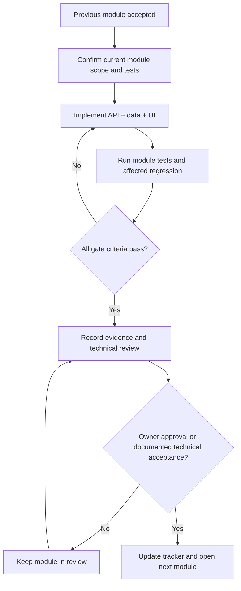

# Workflows: product, implementation and release

Updated 2026-09-20. All-feature launch required. Owner-confirmed target: October 15, 2026, IST. This describes intended workflows; current gaps are in Audit.md.

## Product workflows

### Identity

Visitor submits validated registration → rate limiter → normalized unique identity → password hash/session creation → authenticated workspace. Login has generic failure and bounded attempts. Session expiry prompts login while preserving safely recoverable draft state. Logout revokes server session and clears client caches. Profile save updates shared identity immediately.

### Upload and review

Select/drop accepted file → display name/size/privacy notice → authenticated upload authorization → private storage → verify signature and cap → parse → ready/needs_review/failed. Show extracted facts for correction. Only confirmed usable text can proceed to analysis. Retry never silently creates duplicates; cancellation does not claim success. Delete confirms object name, removes file/derived private data under the chosen retention policy and prevents future access by ID.

### Match and improve

Choose owned resume version → paste/reuse owned JD → validate → submit idempotent bounded analysis → validate provider response → persist method/version/results → display score and evidence or honest partial/unavailable status. Open a historical result using its ID. Apply a suggestion only after user review, creating a new draft/version; previous score remains tied to the previous input.

### Builder and export

Open existing or blank structured draft → enter contact/facts → optional AI suggestion → compare/apply/dismiss → save with revision → full preview → export. Missing experience stays empty for students. Export includes exactly the reviewed content and contact details. Refresh/restart recovers confirmed saves; conflicting edits return a recoverable conflict rather than overwrite.

### Job discovery and tracking

Choose resume version/preferences → enqueue bounded scan → show task/source status → fetch verified sources → normalize URL/date/location → update listing cache → score against chosen version → persist → paginate. Save/apply/ignore update user activity snapshots; unmark actions restore prior state. Expired source listings remain visible as expired if saved. Partial source failure is explicit; no made-up role or source link is generated.

## Module delivery workflow

Branch/worktree if needed uses `codex/` prefix. Preserve unrelated working changes. Keep commits focused by module; PR describes concrete before/after behavior, test evidence and migration risk. Never use a historical checklist or a green build alone as approval.

## Test workflow

Run local unit tests with synthetic data and mocked AI/network → integration tests with isolated Mongo/storage and two identities → contract tests → browser E2E for the module → staging provider/source validation → targeted regression of prior modules → update Test_Cases.md execution ledger and Work_Tracker.md. Do not use production resumes as fixtures. Tests that reproduce old defects are separate from acceptance tests asserting the fix.

## Daily control

At start: select one active module, list remaining gate cases and unresolved risks. At end: record actual completed work, evidence, remaining cases, hours spent and projected finish; if a gate misses its checkpoint, show the new forecast. Blocked infrastructure/provider access is a blocker, not a test pass. Do not open a later module just because its scheduled date arrived.

Owner confirmed all current features are required, so deadline contingency is to fix/replan or hold launch. Scope removal requires a new explicit owner decision. Avoid introducing new features to compensate for missing core features.

## Release workflow

1. Before public release, all M1–M5 gates accepted; no P0 or unmitigated high vulnerability in exposed paths; dependency/build/lint/critical regression evidence current.
2. Deploy candidate to isolated staging with production-like services; verify direct page loads, session/cookie/proxy behavior, 5 MB upload path, private downloads, worker restart/retries and provider limits.
3. Back up and restore sample dataset/storage; verify migrated references and old saved history. Record immutable candidate revision and rollback target.
4. Review full desktop/mobile journey and exported resume; set product metadata/support/privacy, monitoring and budget alerts. Confirm service availability/source coverage and actual account plan limits.
5. Owner go/no-go against a concrete evidence bundle. Vercel/provider accounts and billing are user-managed; no unreviewed purchases or provider messages.
6. Publish immutable build/config, run synthetic production smoke test, verify alerts and rollback routing. Record actual URL/time/revision in tracker.
7. If privacy/auth/data-integrity failure appears, contain the affected endpoint and roll back compatible code. Keep incident evidence redacted; do not erase user data as a recovery shortcut.

No recurring monitor or scheduled automation was created by this audit. Post-release monitoring must be configured as part of M6 and tested.
